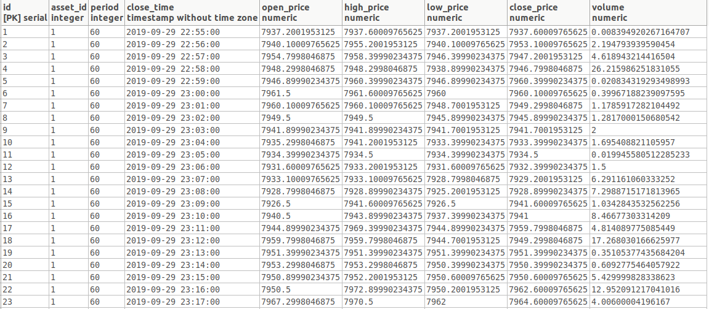

# OHLC

Service for downloading and storing OHLC data

## Build, test and run

1. Create `postgreSQL` database (default `ohlc`)
2. Configure `.env` file
3. Build and run OHLC service
```
$ make build
$ make test

$ ./ohlc
```

## Service architecture
1. Each downloader has separate goroutine for downloading data. Data is downloaded simultaneously for different sources.
2. Each downloader gets data one by one for needed assets. Download process inside one source is not simultaneous because our IP/Service can be banned/blocked by data providers.
3. Each downloader has separate queue for running downloader.
4. Scheduler pushes EACH downloader each 60 sec
5. If downloader is processing previous task, Scheduler is available to push to queue only ONE task for waiting. And this waiting task will be running immediately when previous long task is finished (but guarantee requests rate limit).   
6. All downloaders implepent interface `Downloader` and extend base structure and methods `downloader`
7. Architecture allows to add any new downloader with custom configuration, authorizations, etc. You need to write custom methods for your class that overwrites methods from base class.
8. I don't know full information about how data from database will be used. So structure of tables can be another. I didn't create a lot of INDEXes, because I need to know information about SELECTs for that.
9. Service supports several LOG levels: "panic","fatal","error","warning","info","debug","trace"
10. For rate limiting requests I use Timer because Ticker doesn't stable sleep time between requests   

## Examples
1. Successful log example with tags `asset=BTC/USD/KRAKEN` and `downloader=CRYPTOWAT`


2. Error log example


3. Table `assets` example


4. Table `candles` example

